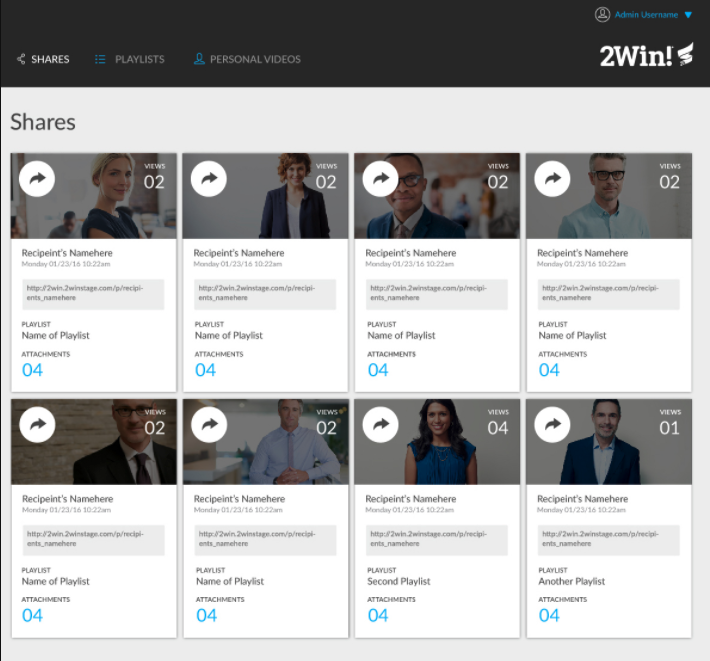
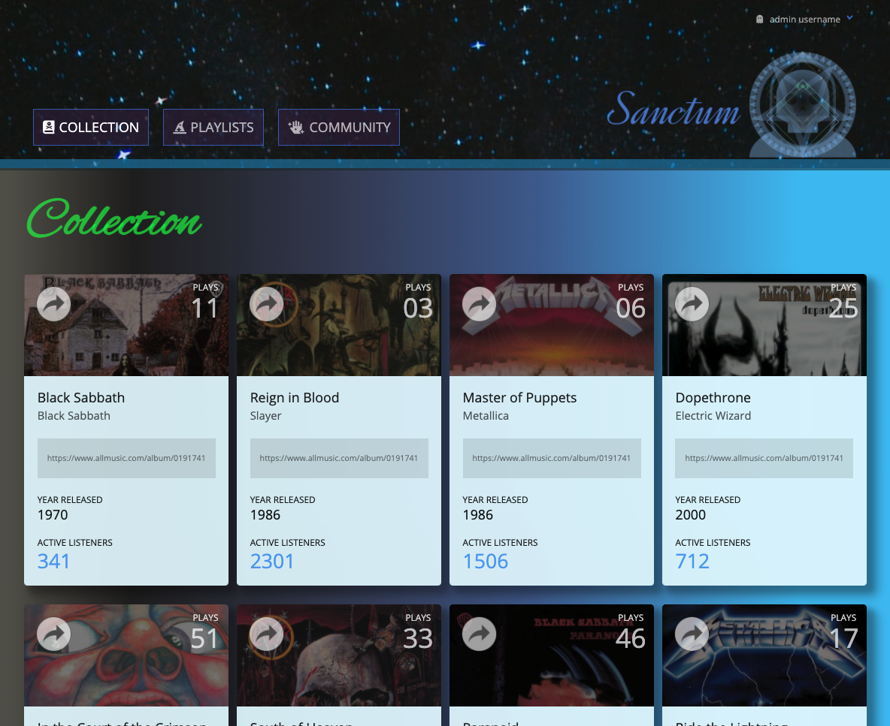
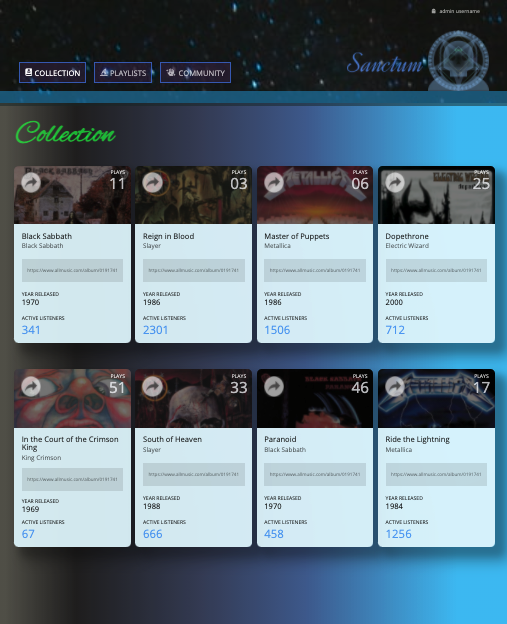
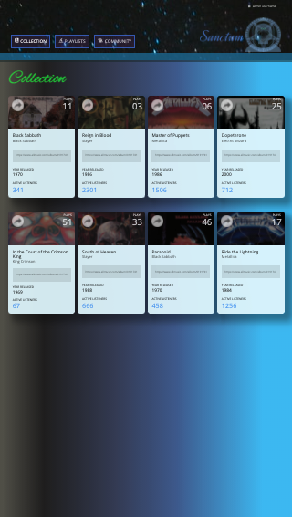

# Static Comp Challenge

- [Deployed Page](https://pcmueller.github.io/static-comp/)

A challenge to recreate the layout and responsiveness of a website based on a single screenshot.

## Abstract

The static comp challenge is a challenge to visually recreate a website with only a single screenshot as a blueprint, using only HTML and CSS. While creative-license is permitted in this assignment with respect to copy, images, icons, and color-palette, the layout must reflect that of the original comp image.  The project repository is expected to include and utilize a normalize or reset file in order to remove the default properties of semantic HTML elements in CSS, and the 
site should employ responsive design, allowing the display to scale down proportionately in mobile-view.

- [Project Specs](https://frontend.turing.io/projects/module-1/m1-static-comp)

## Images

### Original

### Static Adaptation

## Contributors

[Peter Muellerleile](https://github.com/pcmueller/)
